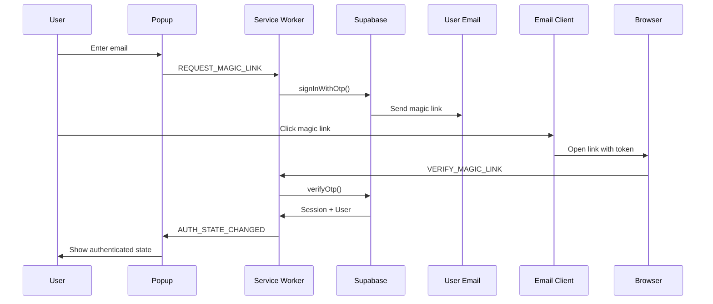

# Supabase Integration Summary

## Overview

This document summarizes the Supabase authentication and API integration implemented for the UpdateAI Chrome extension.

## Architecture

### Components

1. **Supabase Client** (`src/api/supabase-client.js`)
   - Singleton wrapper around Supabase JS client
   - Handles authentication state management
   - Provides clean API methods for all operations
   - Manages session persistence in chrome.storage

2. **Service Worker** (`src/background/service-worker.js`)
   - Initializes Supabase client on startup
   - Listens for auth state changes
   - Manages background sync via alarms
   - Handles migration of local data to Supabase

3. **Popup UI** (`src/popup/popup.js`)
   - Updated State methods to use Supabase
   - Offline-first architecture (saves locally, then syncs)
   - Real-time auth status display
   - Seamless fallback to local storage when offline

4. **Auth UI** (`src/popup/auth-ui.js`)
   - Magic link authentication flow
   - Email validation and error handling
   - Polling for auth completion
   - User profile display with logout

5. **Sync Queue** (`src/api/sync-queue.js`)
   - Offline-first sync queue for captures
   - Automatic retry with exponential backoff
   - Conflict resolution (last-write-wins)
   - Background sync every 5-10 minutes

## Authentication Flow

### Magic Link Sign-In



### Token Management

- **Storage**: Tokens stored in `chrome.storage.local` via Supabase's custom storage adapter
- **Refresh**: Automatic token refresh handled by Supabase client
- **Persistence**: Sessions persist across extension restarts
- **Expiration**: Default 7-day session, auto-refresh every hour

## Data Operations

### Offline-First Strategy

All data operations follow this pattern:

1. **Write locally first** (instant feedback)
2. **Add to sync queue** (for later sync)
3. **Sync to Supabase** (if online and authenticated)
4. **Update local copy** (with server IDs and timestamps)

Example: Saving a project

```javascript
async saveProject() {
  // 1. Save locally (always succeeds, even offline)
  await chrome.storage.local.set({ project: this.project });
  
  // 2. Sync to Supabase (if authenticated)
  if (this.isAuthenticated && supabaseClient.isAuthenticated()) {
    const response = await supabaseClient.saveProject(this.project);
    
    if (response.success) {
      // 3. Update local with server ID
      this.project.id = response.project.id;
      await chrome.storage.local.set({ project: this.project });
    }
  }
}
```

### Project Storage

Projects are stored as special captures with `type = 'project'`:

```javascript
{
  user_id: 'uuid',
  type: 'project',
  source: 'extension',
  title: 'Project Name',
  content: 'Project with 5 links',
  metadata: {
    links: [ /* array of links */ ],
    createdAt: 1234567890
  }
}
```

### Capture Sync

Captures follow the sync queue pattern:

1. User creates capture on webpage
2. Extension saves locally with `syncStatus: 'pending'`
3. Background worker picks up from sync queue
4. Syncs to Supabase with retry logic
5. Updates local copy with `serverId` and `syncStatus: 'synced'`

## API Methods

### Authentication

- `supabaseClient.init()` - Initialize and restore session
- `supabaseClient.requestMagicLink(email)` - Send magic link
- `supabaseClient.verifyOTP(email, token)` - Verify magic link token
- `supabaseClient.signOut()` - Sign out and clear session
- `supabaseClient.refreshSession()` - Manually refresh session

### Captures

- `supabaseClient.createCapture(capture)` - Create new capture
- `supabaseClient.getCaptures(filters)` - Get all captures
- `supabaseClient.updateCapture(id, updates)` - Update capture
- `supabaseClient.deleteCapture(id)` - Delete capture

### Projects

- `supabaseClient.getProject()` - Get current user's project
- `supabaseClient.saveProject(project)` - Save/update project
- `supabaseClient.deleteProject(id)` - Delete project

### Workspaces

- `supabaseClient.getWorkspaces()` - Get all workspaces
- `supabaseClient.createWorkspace(data)` - Create workspace
- `supabaseClient.addCaptureToWorkspace(wsId, captureId)` - Link capture

## State Management

### Auth State

```javascript
State = {
  isAuthenticated: boolean,  // Supabase session exists
  user: {                    // From Supabase user object
    id: 'uuid',
    email: 'user@example.com',
    name: 'User Name'
  }
}
```

### Sync State

```javascript
syncStatus = {
  total: 10,           // Total captures
  synced: 8,          // Successfully synced
  pending: 2,         // Waiting to sync
  localOnly: 1,       // Never synced (local-only)
  queueSize: 2,       // Items in sync queue
  isOnline: true,     // Internet connection
  isAuthenticated: true
}
```

## Error Handling

### Network Errors

- **Offline**: Operations queue locally, sync when online
- **Timeout**: Automatic retry with exponential backoff
- **Server Error**: Retry up to 3 times, then show error

### Auth Errors

- **Token Expired**: Automatic refresh attempt
- **Refresh Failed**: Sign out and redirect to login
- **Invalid Token**: Clear session and re-authenticate

### Data Conflicts

- **Last-Write-Wins**: Server timestamp determines winner
- **Local-Only Items**: Always preserved, never deleted by server
- **Deleted on Server**: Kept locally if modified after server deletion

## Security

### Token Storage

- Tokens stored in `chrome.storage.local` (encrypted by Chrome)
- Never logged to console in production
- Cleared completely on sign out

### Row Level Security (RLS)

All Supabase tables have RLS enabled:

```sql
-- Users can only access their own data
CREATE POLICY "Users can access own data"
ON captures FOR ALL
USING (auth.uid() = user_id);

-- Workspace members can access workspace data
CREATE POLICY "Members can access workspace"
ON workspace_captures FOR ALL
USING (
  workspace_id IN (
    SELECT workspace_id FROM workspace_members
    WHERE user_id = auth.uid()
  )
);
```

### API Key Security

- Anon key is public-safe (intended for client-side use)
- RLS policies protect data access
- Service key never exposed to client
- Environment variables for configuration

## Performance Optimizations

### Caching

- Projects cached locally for instant load
- Captures cached with TTL (10 minutes)
- User profile cached until logout

### Batch Operations

- Sync queue processes multiple items in batch
- Background sync runs every 5 minutes
- Pull updates every 10 minutes

### Lazy Loading

- Workspaces loaded only when authenticated
- Full captures fetched on-demand
- Real-time updates opt-in per workspace

## Testing Strategy

### Manual Testing

1. **Auth Flow**
   - Sign in with magic link
   - Token refresh after 1 hour
   - Sign out and verify cleanup

2. **Offline Mode**
   - Create data while offline
   - Reconnect and verify sync
   - Check conflict resolution

3. **Multi-Device Sync**
   - Sign in on two devices
   - Create data on Device A
   - Verify appears on Device B

### Automated Testing

```javascript
// Unit tests for Supabase client
describe('SupabaseClient', () => {
  it('should initialize with stored session', async () => {
    // Mock chrome.storage
    // Call init()
    // Verify session restored
  });
  
  it('should handle auth state changes', async () => {
    // Mock auth state change
    // Verify event handler called
    // Verify state updated
  });
});

// Integration tests
describe('Project Sync', () => {
  it('should sync project to Supabase', async () => {
    // Create project locally
    // Wait for sync
    // Verify in Supabase
  });
});
```

## Migration Path

### From Local Storage to Supabase

1. **Phase 1**: Add Supabase integration (current)
   - All new users start with Supabase
   - Existing users continue with local storage
   - No breaking changes

2. **Phase 2**: Automatic migration
   - On first sign-in, migrate local data to Supabase
   - Keep local copy as backup
   - Mark as migrated to prevent duplicate sync

3. **Phase 3**: Supabase-first (future)
   - Remove local storage fallback
   - All data operations via Supabase
   - Local storage only for cache

### Migration Code

```javascript
async function migrateLocalData() {
  const result = await chrome.storage.local.get(['captures', 'project', 'hasMigrated']);
  
  if (result.hasMigrated) {
    return { success: true, message: 'Already migrated' };
  }
  
  // Migrate captures
  for (const capture of result.captures || []) {
    await supabaseClient.createCapture(capture);
  }
  
  // Migrate project
  if (result.project) {
    await supabaseClient.saveProject(result.project);
  }
  
  await chrome.storage.local.set({ hasMigrated: true });
}
```

## Monitoring and Debugging

### Logging

All operations log to console with prefixes:

- `[Supabase]` - Supabase client operations
- `[SyncQueue]` - Sync queue operations
- `[UpdateAI]` - General extension operations
- `[Auth]` - Authentication operations

### Debugging Tools

1. **Chrome DevTools**
   ```javascript
   // Popup console
   chrome.storage.local.get(null, console.log)
   
   // Service worker console
   chrome.alarms.getAll(console.log)
   ```

2. **Supabase Studio**
   - View real-time logs
   - Query data directly
   - Monitor auth sessions
   - Check RLS policy logs

3. **Extension Inspection**
   ```
   chrome://extensions/
   → UpdateAI
   → service worker: Inspect
   → popup: Right-click → Inspect
   ```

## Known Limitations

1. **Session Duration**: 7-day default, requires re-authentication
2. **Offline Limit**: No limit on local storage, but sync queue has 5 retry attempts
3. **Conflict Resolution**: Last-write-wins, no manual conflict resolution UI
4. **Real-time Updates**: Not implemented yet (polling every 10 minutes)
5. **Batch Size**: Sync queue processes one item at a time (can be optimized)

## Future Enhancements

1. **Real-time Collaboration**
   - WebSocket connection via Supabase Realtime
   - Live cursor positions
   - Instant updates across devices

2. **Conflict Resolution UI**
   - Show conflicts to user
   - Allow manual resolution
   - Three-way merge for complex conflicts

3. **Optimistic Updates**
   - Show UI updates immediately
   - Rollback on sync failure
   - Visual feedback for sync status

4. **Advanced Caching**
   - Service Worker cache API
   - IndexedDB for large datasets
   - Smart cache invalidation

5. **Analytics**
   - Track sync success rate
   - Monitor auth failures
   - User engagement metrics

## Support and Resources

- **Supabase Docs**: https://supabase.com/docs
- **Chrome Extensions**: https://developer.chrome.com/docs/extensions/
- **Setup Guide**: See `SETUP_GUIDE.md`
- **API Reference**: See `backend/docs/API.md`

## Changelog

### v1.0.0 (Current)
- ✅ Supabase authentication with magic links
- ✅ Project sync to Supabase
- ✅ Capture sync with offline queue
- ✅ Workspace integration
- ✅ Token management and refresh
- ✅ Migration from local storage

### v1.1.0 (Planned)
- ⏳ Real-time collaboration
- ⏳ Conflict resolution UI
- ⏳ Advanced caching
- ⏳ Analytics dashboard

---

**Last Updated**: January 28, 2026
**Author**: Staff Software Engineer
**Version**: 1.0.0
